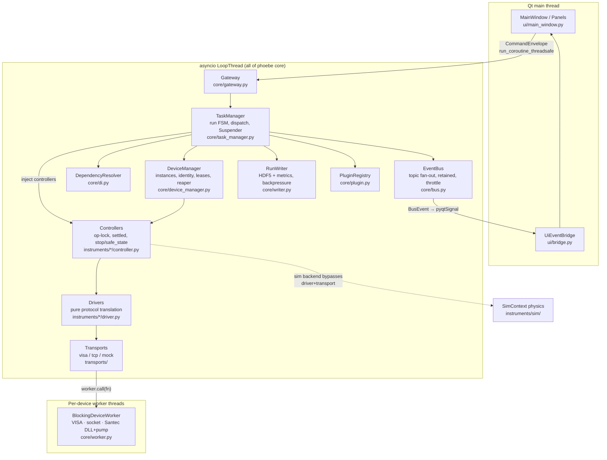
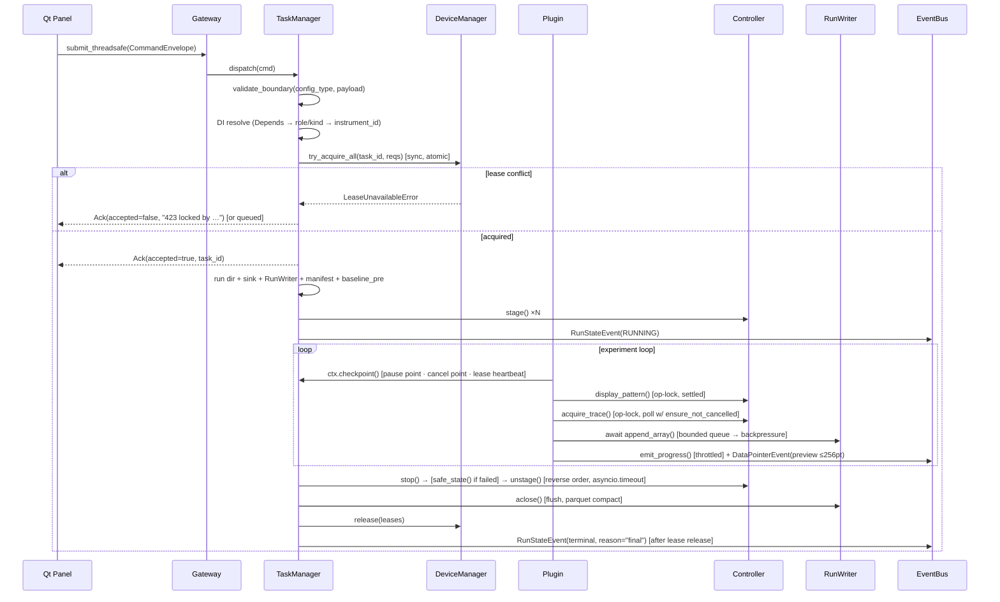
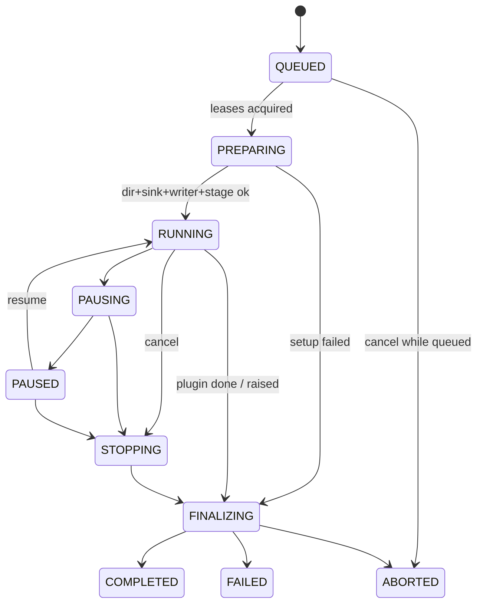
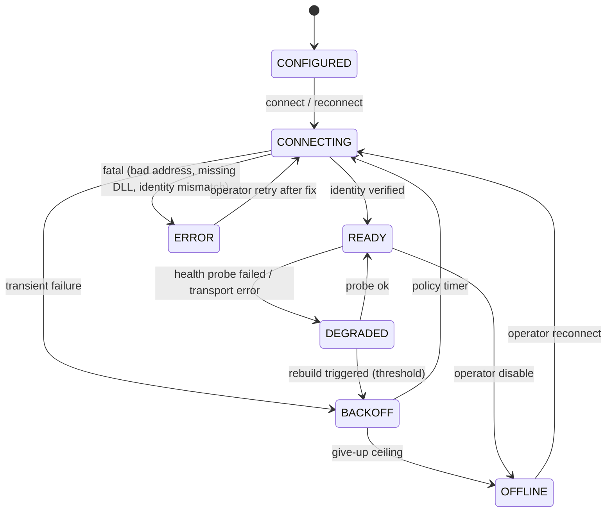

# PHOEBE Evolution Plan

**Systematic architecture review of PHOEBE, cross-referenced against AstrBot's engineering
practice, with a phased long-term evolution plan.**

| | |
|---|---|
| Status | Proposal (review deliverable) |
| Baselines reviewed | PHOEBE `main@4703ff0` + working tree; AstrBot vendored under `AstrBot/` |
| Method | 10 parallel deep-read analyses (5 Phoebe subsystems, 5 AstrBot subsystems, ~1.2M tokens of code reading) + first-hand read of `refactor.md` and all of `phoebe/core`; independent first draft written **before** reading `ASTRBOT_DESIGN_LESSONS.md`; every issue-inventory claim then adversarially re-verified against the code |
| Companion documents | [01-independent-first-draft.md](01-independent-first-draft.md) (pre-cross-reference draft, kept verbatim); [refactor.md](../../refactor.md) (authoritative spec); [ASTRBOT_DESIGN_LESSONS.md](../../ASTRBOT_DESIGN_LESSONS.md) |

---

## Table of contents

1. [Current architecture overview](#1-current-architecture-overview)
2. [Issue inventory](#2-issue-inventory)
3. [Transferable designs from AstrBot](#3-transferable-designs-from-astrbot)
4. [Independent first-draft proposal (summary)](#4-independent-first-draft-proposal)
5. [Cross-reference with ASTRBOT_DESIGN_LESSONS.md](#5-cross-reference-with-astrbot_design_lessonsmd)
6. [Final target architecture](#6-final-target-architecture)
7. [Proposed directory structure and migration map](#7-proposed-directory-structure-and-migration-map)
8. [Phased roadmap and PR slicing](#8-phased-roadmap-and-pr-slicing)
9. [Costs, alternatives, and Definition of Done](#9-costs-alternatives-and-definition-of-done)

---

## 1. Current architecture overview

### 1.1 Verdict up front

PHOEBE (~5.2k lines of source + ~2.5k of tests) is a **young but unusually
spec-faithful** implementation of `refactor.md` v2. The load-bearing architectural
decisions are not aspirational — they are implemented and mechanically enforced:

- **Control/data plane separation** is enforced three ways: schema caps on previews
  ([events.py:53-57](../../phoebe/core/events.py#L53-L57)), a dev-mode 64 KB
  serialize-and-assert on every publish
  ([bus.py:121-126](../../phoebe/core/bus.py#L121-L126)), and `ContractModel`'s strict
  schema which cannot type an ndarray field.
- **Contract choke points are real**: `validate_boundary()` is applied at exactly the
  three documented entries — config parse
  ([config.py:128](../../phoebe/core/config.py#L128)), command dispatch
  ([task_manager.py:204](../../phoebe/core/task_manager.py#L204)), capability invoke
  ([capability.py:125-126](../../phoebe/core/capability.py#L125-L126)).
- **Lease acquisition is genuinely atomic** — a synchronous, await-free scan with
  rollback ([device_manager.py:123-165](../../phoebe/core/device_manager.py#L123-L165));
  no hold-and-wait, deadlock structurally excluded.
- **Threading discipline holds**: Qt thread → loop only via
  `gateway.submit_threadsafe`; loop → Qt only via `UiEventBridge`'s signal; blocking
  calls only on per-device workers, with the Santec DLL loaded by an initializer on its
  own pumping thread ([worker.py:47-160](../../phoebe/core/worker.py#L47-L160)).
- The **L4 sim test is an architecture test**: one dispatch→cleanup cycle asserts data
  completeness, pointer discipline, zero bus drops and zero lease leaks simultaneously
  ([test_e2e_sim.py:71-117](../../tests/test_e2e_sim.py#L71-L117)), driven by a physics
  model where mask coherence really moves the OSA peak.

The consistent weakness — across every subsystem — is equally clear: **happy paths are
excellent; failure, recovery, and lifecycle paths are incomplete; and there is no
service/query surface**. That asymmetry, not modularity, defines the work ahead.

### 1.2 Component map



### 1.3 Key call chain: one run, end to end



### 1.4 Core domain objects

| Object | Where | Role |
|---|---|---|
| `ContractModel` + `NewType` ids + bounded scalars | [contracts.py](../../phoebe/core/contracts.py) | frozen/strict/extra-forbid base for everything crossing a boundary |
| `CommandEnvelope` / `CommandAck` | [gateway.py:24-37](../../phoebe/core/gateway.py#L24-L37) | must-deliver command channel; ack is the only reply |
| `BusEvent` family + `GatewayEvent` union | [events.py](../../phoebe/core/events.py) | droppable observation vocabulary; discriminated by `event_type` string |
| `RunState` FSM + `_RunRecord` | [task_manager.py:44-158](../../phoebe/core/task_manager.py#L44-L158) | QUEUED→RUNNING→…→terminal, every transition broadcast |
| `RunContext` | [task_manager.py:67-135](../../phoebe/core/task_manager.py#L67-L135) | aggregated framework services injected into plugins (checkpoint, writer, emit, log, cancel token) |
| `Lease` / `LeaseSet` (refcounted) | [lease.py](../../phoebe/core/lease.py) | ownership-table rows; inheritance machinery present but unwired |
| Capability `Protocol`s (5 kinds) | [instruments/protocols.py](../../phoebe/instruments/protocols.py) | the stable surface experiments depend on; explicit protocol→kind table for DI |
| `Capability` descriptors + `CapabilityRegistry` | [capability.py](../../phoebe/core/capability.py) | model-specific ops with validation choke point |
| Domain dual-track models | [domain/](../../phoebe/domain/) | ContractModel configs + frozen ndarray dataclasses per instrument family |
| `RunManifest` / `DataPointer` / `MaskRecipe` | [writer.py:43-77](../../phoebe/core/writer.py#L43-L77) | provenance & data-plane pointers |

### 1.5 Dependency structure (observed, not just documented)

`ui → {gateway, events, config}` only (verified — no Controller/Driver imports);
`plugins → {plugin, contracts, domain, protocols, sweep}`;
`core` internally: task_manager → {bus, capability, config, contracts, controller,
device_manager, di, errors, events, gateway, lease, plugin, writer} — TaskManager is
the widest hub. Instruments depend downward on core only. Lazy-import discipline for
`pyvisa`/`nidaqmx`/`PyQt5` holds at module level. **No import-linter, CI, linter, or
type-checker exists to enforce any of this** ([pyproject.toml:27-29](../../pyproject.toml#L27-L29)).

Global singletons: `plugin_registry` ([plugin.py:88](../../phoebe/core/plugin.py#L88)),
the protocol→kind table ([di.py:26](../../phoebe/core/di.py#L26)), the lease-id counter.
Everything else hangs off the `AppRuntime` composition root
([bootstrap.py:25-76](../../phoebe/app/bootstrap.py#L25-L76)).

---

## 2. Issue inventory

Every entry was verified against the code during this review (an adversarial
verification pass re-checked each file:line citation). Severity calibration:
**Critical** = data loss / hang / hardware-unsafe in normal operation; **High** = blocks
a stated goal or silent misbehavior; **Medium** = maintainability / latent trap;
**Low** = polish.

### 2.1 Critical

| ID | Issue | Evidence | Impact / trigger |
|----|-------|----------|------------------|
| **C1** | **Writer-task death permanently hangs the run.** `_open_files` runs before the writer task's `try` and `_write_metric` is unguarded; either failing kills the writer task, leaving every producer parked on an unresolved future. Cancellation is checkpoint-only and a plugin parked on `await fut` never reaches a checkpoint; `request_cancel` never calls `task.cancel()` on the run task. Lease heartbeats stop; the run occupies RUNNING forever. | [writer.py:151-156](../../phoebe/core/writer.py#L151-L156), [writer.py:183](../../phoebe/core/writer.py#L183), [writer.py:196](../../phoebe/core/writer.py#L196); [task_manager.py:105-116](../../phoebe/core/task_manager.py#L105-L116), [task_manager.py:258-273](../../phoebe/core/task_manager.py#L258-L273) | Disk-full during an overnight sweep → unkillable run, no terminal event, UI permanently blocked. Zero test coverage of writer failure. |
| **C2** | **App shutdown never drains active runs.** `AppRuntime.shutdown()` stops suspenders → disconnects controllers → stops workers; it never cancels or awaits active runs. `LoopThread.stop()` then halts the loop with the run coroutine mid-await, so the run's `finally` (stop/safe_state, writer close, baseline_post, lease release, final event) never executes. Real hardware is left in whatever state it was in, with its session closed underneath it. | [bootstrap.py:36-39](../../phoebe/app/bootstrap.py#L36-L39), [bootstrap.py:106-108](../../phoebe/app/bootstrap.py#L106-L108); [ui/app.py:54-58](../../phoebe/ui/app.py#L54-L58) | User closes the window mid-run — an entirely routine action. |

### 2.2 High

| ID | Issue | Evidence | Impact / trigger |
|----|-------|----------|------------------|
| **H1** | **Pause→cancel race misclassifies the run as FAILED.** `request_cancel` never clears `pause_requested`; a checkpoint that arrives after cancel enters the pause branch and calls `set_state(PAUSED)` from STOPPING — illegal → `RuntimeError` escapes the plugin → run reported FAILED (not ABORTED), spurious `ErrorEvent`, `safe_state()` invoked. | [task_manager.py:105-116](../../phoebe/core/task_manager.py#L105-L116), [task_manager.py:258-268](../../phoebe/core/task_manager.py#L258-L268), [task_manager.py:150-158](../../phoebe/core/task_manager.py#L150-L158) | User clicks Pause then Cancel within one checkpoint interval. Tests cover pause→resume→cancel but not pause→cancel. |
| **H2** | **Any failure before RUNNING produces a zombie run.** `stage()`/manifest/baseline run while state is QUEUED; on exception the handler's `set_state(FAILED)` is itself an illegal `QUEUED→FAILED` transition → `RuntimeError` inside the except block. The record stays QUEUED forever (non-terminal), the "final" rebroadcast carries `state=QUEUED`, and `active_tasks()` includes it permanently. | [task_manager.py:44-55](../../phoebe/core/task_manager.py#L44-L55), [task_manager.py:326-348](../../phoebe/core/task_manager.py#L326-L348) | A routine hardware fault at `stage()` — the most likely failure moment of a real run. |
| **H3** | **Run setup sits outside try/finally.** `new_run_dir`, `logger.add`, `RunWriter` construction/start all execute before the `try`; an OSError there aborts `_execute` with leases held (recovered only by TTL reaper), a leaked sink, and no terminal event of any kind. | [task_manager.py:300-315](../../phoebe/core/task_manager.py#L300-L315), try begins at [:325](../../phoebe/core/task_manager.py#L325) | Disk full / permission error at run start. |
| **H4** | **Reaper reclamation corrupts the ownership table.** `_reap_once` pops `_owners` rows and the task's LeaseSet but neither cancels the run task nor marks the record — the run keeps executing against devices it no longer owns. When it eventually finishes, `release()` decrefs its original LeaseSet and pops `_owners[iid]` **unconditionally** — deleting the *new holder's* lease if the device was re-acquired, after which a third task can co-acquire it. | [device_manager.py:201-221](../../phoebe/core/device_manager.py#L201-L221), [device_manager.py:167-172](../../phoebe/core/device_manager.py#L167-L172) | Any plugin whose single awaited operation exceeds `lease_ttl_s`; hardware-unsafe end state (two runs on one device). |
| **H5** | **Paused runs stop heartbeating and get reaped.** `checkpoint` touches leases once, then blocks on `resume_event.wait()` with no further touches. Default TTL is 600 s; the Suspender exists precisely for hours-long suspensions. After recovery, resume proceeds against reclaimed devices without error (`release` uses `pop(..., None)`). | [task_manager.py:107-114](../../phoebe/core/task_manager.py#L107-L114); [device_manager.py:201-221](../../phoebe/core/device_manager.py#L201-L221); spec §8.4 | Suspender pause >10 min with the reaper on (the production default, [bootstrap.py:62-63](../../phoebe/app/bootstrap.py#L62-L63)). Untestable today: every fixture passes `start_reaper=False`. |
| **H6** | **No reconnection story anywhere.** `connect_instrument` is called only from startup; startup is all-or-nothing (first failed connect aborts boot); transports keep dead handles after errors (TCP keeps `self._sock`, VISA keeps `self._inst`); health is checked exactly once ([ui/app.py:52](../../phoebe/ui/app.py#L52)); nothing consumes "error" health to act; the DI resolver snapshots inventory at construction so a reconnected device with different capabilities is invisible. | [device_manager.py:50-64](../../phoebe/core/device_manager.py#L50-L64); [tcp.py:118-146](../../phoebe/transports/tcp.py#L118-L146); [visa.py:110-120](../../phoebe/transports/visa.py#L110-L120); [task_manager.py:189-193](../../phoebe/core/task_manager.py#L189-L193) | One transient LAN/VISA glitch permanently kills an overnight optimizer; a mid-shift device drop requires app restart. |
| **H7** | **A real R&S RTO6 can never pass identity verification.** The factory key requires config `vendor="rohde-schwarz"`; `_verify_identity` requires that exact token as a substring of the device's IDN response, which is `ROHDE&SCHWARZ,RTO6,…` per the controller's own docs. No normalization exists; no vendor string satisfies both checks. Sim mode masks it entirely. | [instruments/registry.py:27](../../phoebe/instruments/registry.py#L27); [device_manager.py:70-78](../../phoebe/core/device_manager.py#L70-L78); [rs_rto6/controller.py:87-96](../../phoebe/instruments/rs_rto6/controller.py#L87-L96) | First real-hardware connect of the scope. |
| **H8** | **VISA binary downloads can truncate at any 0x0A byte.** `read_termination="\n"` is set on the resource; `read_raw()` honors the termchar on most backends; float32 waveform blocks contain 0x0A statistically every ~256 bytes → "IEEE block truncated" on nearly every scope download. *(Backend-dependent — needs one real read or a pyvisa-sim test to confirm; no L1 test covers the path.)* | [visa.py:76-79](../../phoebe/transports/visa.py#L76-L79), [visa.py:130-137](../../phoebe/transports/visa.py#L130-L137); [transport.py:53-56](../../phoebe/core/transport.py#L53-L56) | First real waveform download. |
| **H9** | **TCP binary read: infinite busy-loop on connection close.** The header/length loops do `recv()` with no empty-chunk check; a peer close returns `b""` forever → the device's only worker thread spins at 100 % CPU and every later `worker.call` queues behind it with no error surfaced. `socket.timeout` in these loops also escapes unmapped. | [tcp.py:163-172](../../phoebe/transports/tcp.py#L163-L172) (compare mapped text path [:137-142](../../phoebe/transports/tcp.py#L137-L142)) | Device drops the link mid-block — a realistic LAN event. |
| **H10** | **Santec frame display leaks a multi-MB temp CSV per frame.** `NamedTemporaryFile(delete=False)` is written per `display_frame` and never unlinked; keepalive re-sends multiply it. A 10k-iteration optimization leaks on the order of 90 GB into %TEMP%. | [santec_slm200/driver.py:176-184](../../phoebe/instruments/santec_slm200/driver.py#L176-L184); keepalive [controller.py:221-239](../../phoebe/instruments/santec_slm200/controller.py#L221-L239) | Normal operation of the platform's primary instrument. |
| **H11** | **Queued runs stall forever when the reaper frees leases.** `_maybe_start_next_queued` is invoked only from `_execute`'s finally; the reaper frees devices with no callback. Overnight batch (QUEUE policy's stated purpose): one hung run gets reaped → everything behind it waits indefinitely on free devices. | [task_manager.py:373](../../phoebe/core/task_manager.py#L373), [task_manager.py:408-419](../../phoebe/core/task_manager.py#L408-L419); [device_manager.py:212-221](../../phoebe/core/device_manager.py#L212-L221) | The exact workload QUEUE exists for. |
| **H12** | **UI command surface is hardcoded and already drifting.** Each plugin needs a hand-written Qt form with a `command` class attribute; form defaults have diverged from contract defaults (UI `max_steps=50`, points `501` vs `TPAConfig` `100`/`1001`); `trace_name`/`mask_spot_check_every` aren't exposed; every new plugin means editing `main_window.py`; drift is silent because dispatch accepts any valid payload. | [main_window.py:101-132](../../phoebe/ui/main_window.py#L101-L132) vs [tpa_multiplier.py:31-35](../../phoebe/plugins/tpa_multiplier.py#L31-L35) | Every plugin addition; silent parameter drift between what the form claims and what runs. |
| **H13** | **No CI, no import-linter, no lint/type gate.** Spec §14.3 makes L4 a CI gate and §18-13 mandates import-linter; `main_window.py:6` even claims the contract "holds". None of it exists — layering is enforced by convention only. | [pyproject.toml:27-29](../../pyproject.toml#L27-L29); no `.github/` at root | Any contributor PR can silently violate every invariant. |
| **H14** | **Run outcome is never persisted; failure path has zero tests; drop counters unobservable.** `run.json` is written before RUNNING and never updated — a crashed run dir is indistinguishable from a completed one. No test ever produces `RunState.FAILED`, so `safe_state()`-on-failure, ErrorEvent publication, and cleanup-timeout degradation are unexercised. `total_dropped()` has no production caller. | [task_manager.py:326](../../phoebe/core/task_manager.py#L326); [writer.py:65-77](../../phoebe/core/writer.py#L65-L77); [bus.py:140-148](../../phoebe/core/bus.py#L140-L148); test suite | Undermines the provenance story; the most safety-critical code paths run for the first time on real hardware. |

### 2.3 Medium (thematic groups)

**Control-protocol typing.**
- "423" is prose inside `CommandAck.reason` (the test greps for `"423"`); the
  terminal-final contract is the magic string `reason == "final"` on a field that
  elsewhere carries human text; `CommandAck` has no error-code field
  ([task_manager.py:221-222](../../phoebe/core/task_manager.py#L221-L222),
  [:371](../../phoebe/core/task_manager.py#L371);
  [gateway.py:32-37](../../phoebe/core/gateway.py#L32-L37);
  [main_window.py:336](../../phoebe/ui/main_window.py#L336)).
- Error context dropped at the event boundary: `InstrumentError.instrument_id` /
  `last_command` exist ([errors.py:13-17](../../phoebe/core/errors.py#L13-L17)) but are
  never mapped into `ErrorEvent.instrument_id`
  ([task_manager.py:342-345](../../phoebe/core/task_manager.py#L342-L345)).

**Encapsulation and hidden state.**
- `request_cancel` reads `self._dm._lease_sets`; `Suspender` reads `self._tm._records`
  ([task_manager.py:270](../../phoebe/core/task_manager.py#L270),
  [:487](../../phoebe/core/task_manager.py#L487),
  [:497](../../phoebe/core/task_manager.py#L497)).
- Fire-and-forget `asyncio.create_task(self._safe_stop(...))` with no strong reference
  ([task_manager.py:273](../../phoebe/core/task_manager.py#L273)) — the documented
  asyncio GC hazard, on the hardware-stop path of all places.
- `_records` never evicted ([task_manager.py:187](../../phoebe/core/task_manager.py#L187)).
- Lease inheritance implemented but unreachable: no production caller passes `parent`;
  `LeaseSet.merge` shares the parent's entire slot dict, so a separately-dispatched
  child's release would decref parent instruments the child never required
  ([lease.py:97-114](../../phoebe/core/lease.py#L97-L114);
  [task_manager.py:218](../../phoebe/core/task_manager.py#L218)).

**Dispatch and DI.**
- Role-based DI never cross-checks kind; injection never verifies protocol conformance —
  a TOML typo (`osa = "primary_slm"`) passes dispatch, acquires leases, and fails mid-run
  with `AttributeError` ([di.py:88-95](../../phoebe/core/di.py#L88-L95);
  [task_manager.py:321-331](../../phoebe/core/task_manager.py#L321-L331)).
- Queue is not FIFO: `_maybe_start_next_queued` starts any startable run — a
  multi-instrument run can be starved indefinitely by single-instrument runs
  ([task_manager.py:408-419](../../phoebe/core/task_manager.py#L408-L419)).
- Binding tables are inert because both shipped plugins hardcode `Depends(role=...)`,
  which takes priority ([di.py:88](../../phoebe/core/di.py#L88);
  [tpa_multiplier.py:48-49](../../phoebe/plugins/tpa_multiplier.py#L48-L49)) — operator
  rebinding via TOML silently does nothing.

**Bus and events.**
- Retained/topic model is per-event-type, not per-entity: a late subscriber to
  `device_health` sees one instrument, not five; a fresh subscriber after a run sees a
  stale `run_state` from an old task
  ([bus.py:128](../../phoebe/core/bus.py#L128);
  [events.py:133-134](../../phoebe/core/events.py#L133-L134)).
- `ERROR` drop policy raises into the publisher mid-fan-out, aborting e.g. `set_state`
  and starving other subscribers of that event
  ([bus.py:50-53](../../phoebe/core/bus.py#L50-L53),
  [:129-130](../../phoebe/core/bus.py#L129-L130)) — a loaded trap for the first
  "serious" subscriber.
- `Subscription.close()` doesn't wake a blocked consumer
  ([bus.py:64-72](../../phoebe/core/bus.py#L64-L72)).
- The 64 KB and cross-thread checks are `assert`s — void under `python -O`
  ([bus.py:116-126](../../phoebe/core/bus.py#L116-L126)); size check counts characters,
  not bytes.
- `LogEvent` is defined, bridged and handled by the UI, but **published by nobody** —
  plugin logs never reach the GUI ([events.py:110-116](../../phoebe/core/events.py#L110-L116)).
- `GatewayEvent` union has zero non-test consumers; no `model_json_schema()` call exists
  anywhere — the §3.6/§13.3 schema-export down-payment on the web frontend is
  unimplemented ([events.py:120-130](../../phoebe/core/events.py#L120-L130)).
- Preview pipeline is spectrum-shaped end to end (`TracePreview` with `x_nm`/`y_dbm` in
  core events; `PlotPanel` hardcodes nm/dBm axes) — no vehicle for scope/DAQ/camera
  previews ([events.py:53-65](../../phoebe/core/events.py#L53-L65);
  [main_window.py:212-215](../../phoebe/ui/main_window.py#L212-L215)).

**Instrument stack.**
- `stop()` bypasses the op-lock but not the worker FIFO — its latency is bounded by the
  longest in-flight blocking call (up to the 30 s timeout); for the SLM, `stop()` is an
  explicit no-op ([visa.py:44-48](../../phoebe/transports/visa.py#L44-L48);
  [santec_slm200/controller.py:155-158](../../phoebe/instruments/santec_slm200/controller.py#L155-L158)).
- Health/snapshot queries bypass the op-lock, interleaving SCPI into acquisitions
  ([yokogawa_aq637x/controller.py:111-131](../../phoebe/instruments/yokogawa_aq637x/controller.py#L111-L131)).
- Sim/real option asymmetry: `SimPatternModulator` validates with base `SlmOptions`
  (extra=forbid), so a real config using `Slm200Options` keys crashes when flipped to
  `backend="sim"` — violating spec §18-12; the other four sim controllers validate
  nothing ([sim/controllers.py:97](../../phoebe/instruments/sim/controllers.py#L97),
  [:45-52](../../phoebe/instruments/sim/controllers.py#L45-L52)).
- Vendor SCPI mnemonics baked into domain contracts (`"NORMal"`, `"CHANnel1"`,
  `"HRESolution"` in the vendor-neutral layer)
  ([domain/scope.py:24-37](../../phoebe/domain/scope.py#L24-L37)).
- Worker edge cases: result relay outside any try (loop closed → worker thread dies and
  existing transports hold a dead reference forever); exceptions relayed to
  already-cancelled futures are silently dropped
  ([worker.py:154-158](../../phoebe/core/worker.py#L154-L158),
  [:168-170](../../phoebe/core/worker.py#L168-L170)).
- L1 tests cover 1 of 5 drivers; L2 transcripts: zero recorded, no recording transport
  exists ([tests/test_drivers_l1.py](../../tests/test_drivers_l1.py);
  [mock.py:75-120](../../phoebe/transports/mock.py#L75-L120)).

**Data plane.**
- No fsync / no SWMR: crash-consistency of `artifacts.h5` is not guaranteed, and no
  external reader can open the file mid-run
  ([writer.py:202](../../phoebe/core/writer.py#L202),
  [:237](../../phoebe/core/writer.py#L237)).
- First append freezes dataset shape/dtype; a mid-run `points` change fails deep in
  h5py with an opaque broadcast error
  ([writer.py:215-224](../../phoebe/core/writer.py#L215-L224)).
- `grid_scan` persists only `y_dbm` + coordinates — `TraceMeta` (instrument, scan
  config, timestamps) is dropped, and the helper is hard-typed to `SpectrumTrace`
  despite billing itself as the generic primitive
  ([sweep.py:35-53](../../phoebe/core/sweep.py#L35-L53)).
- Writer "backpressure" is actually synchronous write-through (producer awaits the
  per-item future → acquisition can't overlap I/O) — stronger than spec but a
  throughput ceiling ([writer.py:151-156](../../phoebe/core/writer.py#L151-L156)).

**UI/app.**
- Single-task assumptions: `_task_id` never cleared, progress/pointer events unfiltered
  by task, `reset_metrics()` fires pre-ack (a rejected 423 wipes the running plot),
  metric plot hardcoded to `peak_dbm`
  ([main_window.py:292](../../phoebe/ui/main_window.py#L292),
  [:335-347](../../phoebe/ui/main_window.py#L335-L347)).
- Bridge re-emits into Qt's unbounded queued-connection queue — the bounded drop policy
  lives on the wrong side of the boundary; previews (`DataPointerEvent`) are not
  throttled at all ([bridge.py:41-43](../../phoebe/ui/bridge.py#L41-L43);
  [task_manager.py:127-132](../../phoebe/core/task_manager.py#L127-L132)).
- Plugin TOML content other than `bindings` is silently discarded
  ([config.py:119-126](../../phoebe/core/config.py#L119-L126)).

### 2.4 Low (abridged)

Loose substring identity matching (`"NI"` matches anything containing "ni",
[device_manager.py:70-77](../../phoebe/core/device_manager.py#L70-L77)); manifest git
provenance uses `Path.cwd()` ([task_manager.py:378](../../phoebe/core/task_manager.py#L378));
`code_version` always `""`; `config_hash` not canonicalized; `instrument_id` uniqueness
never checked; run-dir collision window (second-resolution stamp + `exist_ok=True`);
`validate_boundary`'s `json.dumps(default=str)` silently stringifies exotic types;
`ThrottledEmitter` uses deprecated `asyncio.get_event_loop()`; no `[project.scripts]`
entry point; demo fragility ([run_sim_demo.py:50-55](../../examples/run_sim_demo.py#L50-L55));
mild timing dependence in two tests; the documented conda env lacked pytest and pyarrow
(so the parquet-compaction test silently skips — its guard mirrors the same
ImportError).

---

## 3. Transferable designs from AstrBot

> **License boundary (from ASTRBOT_DESIGN_LESSONS.md §2.1, adopted as a hard rule).**
> AstrBot's backend is AGPL-3.0-or-later; its dashboard is MIT; PHOEBE is MPL-2.0.
> Everything below transfers **designs and protocols, never code**. No AstrBot Python /
> Vue / TypeScript may be copied into `phoebe/`. If asset reuse is ever wanted, do a
> per-file license review first.

**Fundamental business-model difference (do not force analogies).** AstrBot's events are
small, droppable, and independent; handlers are near-stateless; LLM backends are
fungible; the worst failure is a bad chat message. Hence its core choices: unbounded
task-per-event concurrency, log-and-continue error policy, a mutable god-event with an
untyped `_extras` dict, config as a live mutable dict, restart via `os.execv`. PHOEBE's
hardware is stateful and dangerous, data must not drop, access is exclusive and
serialized, and cancellation must reach the physical device. **Every one of AstrBot's
core dispatch semantics is wrong for PHOEBE — and PHOEBE's spec already encodes this
(control/data-plane split, Appendix A). What transfers is AstrBot's operational shell:
registration metadata, lifecycle hygiene, observability plumbing, the config→UI
pipeline, and HTTP-boundary patterns.**

### 3.1 Adopt directly

| # | Design | AstrBot location | Why / how for PHOEBE |
|---|--------|------------------|----------------------|
| A1 | One shared retry/backoff utility with a transient-vs-fatal classifier (tenacity-based; stream-aware context-manager variant) | `provider/sources/request_retry.py:19-163` | AstrBot's *three* divergent hand-rolled adapter retry stacks are the cautionary tale. PHOEBE: `phoebe/core/retry.py` classifying VISA timeout / ConnectionError / DeviceReportedError; exponential backoff + ceiling; per-instrument labels. Foundation of the reconnect story (H6). |
| A2 | Operational state on the adapter base class: status enum, error ring, started-at, `get_stats()` | `platform/platform.py:20-119` | Put on `InstrumentController`. Cap the error list (AstrBot's grows unboundedly). Feeds the device panel and the future API. |
| A3 | Fatal-vs-transient error classification inside reconnect loops (bad token → stop retrying) | `sources/telegram/tg_adapter.py:270-274` | Wrong resource address / missing DLL must surface immediately, not retry forever. |
| A4 | Log broker: ring cache + bounded per-subscriber queues + `Last-Event-ID` replay over SSE | `core/log.py:126-147`; `dashboard/services/log_service.py:29-63` | The replay-after-reconnect contract PHOEBE's bus lacks. In-process now: a loguru sink → `LogEvent` on the existing bus (no second broker — see §5); the ring/replay part lands with the API layer. Fix AstrBot's cross-thread `put_nowait` bug by publishing loop-safely. |
| A5 | Event-loop diagnostics: lag monitor + faulthandler watchdog dumping all thread stacks when the loop wedges | `core/utils/event_loop_diagnostics.py:72-216` | PHOEBE's single-LoopThread + blocking-DLL topology is exactly where this pays off; near-zero cost. |
| A6 | Strong-ref task set + done-callback exception logging for fire-and-forget tasks | `core/event_bus.py:37, 52-63` | Fixes the `_safe_stop` hazard ([task_manager.py:273](../../phoebe/core/task_manager.py#L273)) and becomes the house rule for all background tasks. |
| A7 | Single-instance file lock at process start | `cli/commands/cmd_run.py:63-66` | Two processes opening one VISA resource is a hardware fault, not an inconvenience. |
| A8 | Per-plugin failure records (error + traceback + salvaged metadata) with reload-one-plugin flows; one broken plugin never blocks the rest | `core/star/star_manager.py:771-833, 939-965` | PHOEBE currently hard-fails startup on any plugin import error. Surfaces in UI later. |
| A9 | PEP 440 API-compat specifier in plugin metadata, checked at load with a clear message | `core/star/star_manager.py:625-657` | Prerequisite for any third-party plugin story. |
| A10 | Cheap per-kind health probes (`test()` per capability type) | `core/provider/provider.py:207-317` | OSA = IDN + minimal sweep; DAQ = read one sample; run through the op-lock (also fixes the lock-bypassing health reads). |
| A11 | Atomic config writes (mkstemp → fsync → `os.replace`) | `core/config/astrbot_config.py:234-251` | Mandatory hygiene for anything PHOEBE persists (journal, catalog, config). |
| A12 | Response envelope + typed `ApiError` + global exception handlers; three-state `ok/warning/error` with structured warning data | `dashboard/responses.py:7-22`; `api/app.py:149-163` | The service/API layer's error contract. "Warning" maps to "accepted but degraded". |
| A13 | Task + progress-poll pattern for long HTTP operations, with duplicate-request dedupe | `dashboard/services/update_service.py:101-191` | PHOEBE's run FSM is already the poll target; never copy AstrBot's blocked-await plugin installs. |
| A14 | Static-dist version pinning: `assets/version` file + compatible/fallback-with-warning/refuse cascade + traversal-safe serving | `server.py:185-224`; `utils/io.py:368-475` | Prevents silent UI/backend contract skew when the Vue bundle ships. |
| A15 | Registration carries UI metadata (config schema, display name, capability flags) so the frontend manages N adapters with zero per-adapter frontend code | `platform/register.py:5-63`; `platform_metadata.py:4-37` | The *shape* to copy — but PHOEBE generates the schema from pydantic instead of hand-written dicts (see A-adapt-1). |

### 3.2 Adopt with adaptation

| # | Design | AstrBot location | Required adaptation |
|---|--------|------------------|---------------------|
| B1 | **Schema-as-UI-metadata pipeline** — one declarative schema drives widget choice, grouping, conditional visibility, i18n, and validation; verified end-to-end into `ConfigItemRenderer.vue` | `config/default.py`; `dashboard/services/config_service.py:709-762`; Vue renderer | The headline transfer — **and** the headline anti-pattern: AstrBot's source of truth is a 4.4k-line hand-written dict monolith with *three* coexisting metadata generations, validation still bound to the deprecated one. PHOEBE must **generate** the metadata from existing pydantic contracts (`model_json_schema()` + `json_schema_extra` for hints/widgets/conditions) so schema, validation, and UI cannot drift. Keep three specific inventions: dotted-path presentation keys, client-evaluated `condition` dicts, `_special` escape hatch for domain widgets (PHOEBE analogs: "probe \*IDN?", "preview mask", "detect DAQ channels"). Scope per §5.3 below. |
| B2 | Threshold-triggered client rebuild (N failures in T seconds → tear down and rebuild the handle), signaled thread-safely | `tg_adapter.py:288-319`; KOOK's `min(2**n, max)` backoff | Package as a reconnect-policy object on the Controller base; the rebuild must execute on the device's worker thread (DLL affinity); exponential backoff + give-up ceiling; lease-aware (no rebuild under an active lease without operator consent). |
| B3 | Hot add/remove of adapter instances keyed by config id, with orphan sweep | `platform/manager.py:256-265`; provider CRUD `provider/manager.py:736-877` | Gate teardown on leases (423 an in-use instrument); copy the provider manager's locking, not the platform manager's lack of it. |
| B4 | Plugin discovery: directory scan + manifest; enable/disable without instantiation | `star_manager.py:192-311, 1173-1195` | Manifest is `plugin.toml` (static facts only — see §5.2: `Depends` annotations remain the single source of device requirements). No runtime pip, no market, no auto-update. Registration stays PHOEBE-style declarative; registries become instance-scoped (kill the global singleton for test isolation). |
| B5 | `api/` façade: plugins import only a stable, versioned re-export surface | `astrbot/api/star/__init__.py`; `api/event/filter/__init__.py` | Create `phoebe/api/` re-exporting `Plugin`, `register`, `on_command`, `Depends`, `RunContext` protocol, contract types, capability protocols. Core internals then move freely. |
| B6 | Hot reload via file-watch + module-prefix purge | `star_manager.py:210-263, 694-726` | **Dev-mode only, sim-backend only, and refused while the plugin has held leases or a live run.** AstrBot's observed reload leaks (class-variable registries) are the checklist of what to avoid. Not a production feature. |
| B7 | Structured identity with canonical string form | `platform/message_session.py:6-27` | For run/lease/instrument ids as frozen ContractModels; pick an encoding that never needs sanitizing (AstrBot must forbid `:` in ids because of its raw join). |
| B8 | Ordered stage pipeline (onion) for the command path | `pipeline/scheduler.py:43-76`; `stage_order.py` | Adopt the *shape* as the typed **admission chain** (§6.4) — fixed, closed stage set; typed stage context (never an `_extras` dict); fail-closed with stable reason codes; stages consume cached snapshots only (no device I/O at dispatch). Plugins get hook points, never new stages. |
| B9 | Keyed ref-counted lock manager; event-scoped resource ledger with `finally` cleanup; stream watchdog + idempotent close | `utils/session_lock.py:8-31`; `astr_message_event.py:236-252`; `third_party.py:124-148` | Small resource-safety idioms worth institutionalizing: run-scoped temp-artifact ledger (fixes the shape of H10), watchdog for abandoned preview streams at the API layer. |
| B10 | DB layer: async engine + ABC interface + WAL pragmas + idempotent additive column migrations | `core/db/__init__.py:33-69`; `db/sqlite.py:51-147` | For the run catalog / command ledger / journal index — SQLite via stdlib or SQLModel, rebuildable from run-dir files (the files stay the source of truth); consolidate migrations in one table, not five ad-hoc sniffers. |

### 3.3 Do not copy (with the reason)

| Anti-pattern | AstrBot location | Why it breaks PHOEBE |
|---|---|---|
| Unbounded queue + task-per-event dispatch; broadcast filter scans over all handlers | `platform.py:147-149`; `event_bus.py:52`; `waking_check/stage.py:160-226` | Chat events are independent; instrument commands are not. PHOEBE's addressed commands + leases are strictly stronger. |
| Mutable god-event with untyped `_extras`; dual stop-flag mechanisms | `astr_message_event.py:55, 340-362` | Direct contradiction of the frozen-contract choke-point design; the extras dict is AstrBot's single largest hidden-coupling source. |
| Config as live mutable dict subclass; `__getattr__→None`; **silent pruning of unknown keys**; in-place mutation by services | `astrbot_config.py:204-257`; `config_service.py:1187-1189` | Config errors can drive hardware; silent key deletion is user-data loss. PHOEBE's strict `validate_boundary` is the right call — keep it. |
| Import-time global composition (dirs, config, DB, background thread at `import astrbot.core`) | `astrbot/core/__init__.py:29-47` | Breaks sim-mode/test isolation and PHOEBE's lazy-import rules; makes import order load-bearing. |
| Restart via `os.execv` + psutil child-killing | `updator.py:57-148` | Vendor DLLs and instruments need ordered release; re-exec mid-acquisition orphans hardware state. |
| Error-string-matching capability discovery ("429", "not a VLM"…) | `openai_source.py:1046-1158` | Instruments have deterministic error queues and status registers; classify by code, never message text. |
| In-process pip (`pip._internal` on the live interpreter) | `pip_installer.py:1056-1068` | An interpreter driving hardware must not run pip's code in-process (AstrBot itself has to scrub the logging handlers pip leaks). |
| Provider failover chains / API-key rotation | `tool_loop_agent_runner.py:481-549` | Never auto-substitute instruments or auto-retry state-mutating commands; retries are opt-in per idempotent command class. |
| Dual legacy/v1 route surface + Flask-compat shim (719-line `asgi_runtime.py`) | `api/app.py:165-191` | Pure retrofit debt. The lesson: version the API (`/api/v1`) and pin frontend↔backend from day one. |
| `_task_wrapper` double-task supervision | `core_lifecycle.py:282-341` | Wrapping an already-created task silently breaks cancellation propagation. Supervise coroutines, wrap-then-create once. |
| match/case lazy-import switchboard duplicating the registry | `platform/manager.py:130-196` | PHOEBE's `(kind, vendor, model)` factory registry is already the better mechanism. |
| Stack-frame caller inference; `__del__` as lifecycle hook; constructor-signature sniffing | `star_tools.py:226-242`; `base.py:87-88`; `star_manager.py:1176-1188` | Implicit magic that breaks under wrapping/threading; PHOEBE's explicit `ctx` is right. |

---

## 4. Independent first-draft proposal

The full first draft — written after all code analysis but **before** reading
`ASTRBOT_DESIGN_LESSONS.md` — is preserved verbatim at
[01-independent-first-draft.md](01-independent-first-draft.md). Its five core judgments:

- **J1** — PHOEBE's architecture is fundamentally sound; this is a
  completion-and-hardening program, not a restructuring.
- **J2** — The deepest gap versus PHOEBE's own requirements is **fault recovery and
  lifecycle** (C1/C2/H1–H6/H11), not modularity. Fix these before any feature.
- **J3** — Execute the frontend migration as **"build the application-service layer now;
  make PyQt its first client"** — query surface, machine-readable codes, per-entity
  retained events + replay, exercised serialization. Then Tauri only swaps the transport.
- **J4** — The plugin system needs **metadata, lifecycle, and a façade — not AstrBot's
  dynamism**. PHOEBE's registration/DI core is better than AstrBot's; its *edges*
  (manifest, failure records, enable/disable, `api/` façade, version gating) are missing.
- **J5** — The business models differ fundamentally; adopt AstrBot's **boundary
  engineering**, reject its **dispatch semantics**.

Its phased plan: **A** stabilize the kernel (C/H bugs, failure-path tests, CI/gates) →
**B** device lifecycle & recovery (device FSM, reconnect policy, health poller,
degraded startup, transport bug fixes) → **C** service layer & protocol v2 (error codes,
run persistence, query services, schema export, PyQt as first client) → **D** plugin
platform (manifest, discovery, failure records, `phoebe.api`, schema-driven forms) →
**E** web frontend (FastAPI + SSE/WS wrapping the same services; Vue/Tauri).

---

## 5. Cross-reference with ASTRBOT_DESIGN_LESSONS.md

`ASTRBOT_DESIGN_LESSONS.md` (dated 2026-07-10, verified against `4703ff0`) is a
governance-first proposal. Point-by-point against the independent draft:

### 5.1 Validated by the code (both analyses agree)

| Point | Lessons doc | This review's independent finding |
|---|---|---|
| Skeleton is right; harden around it | Executive summary | J1; strengths list §1.1 |
| Runtime safety before features | P0 = S1/S2 before everything | Phase A; C1/C2/H1–H5 make the case concretely |
| Controlled shutdown protocol is missing | §4.3 `TaskManager.shutdown(deadline)` | C2 — independently found, with the exact failure mechanics (`finally` never runs) |
| Run lifecycle must be persisted; cleanup outcome ≠ execution outcome | §4.2 RunJournal, `execution_outcome` vs `finalized(ok\|degraded)` | H14 (outcome never persisted) + the observation that terminal state is set *before* cleanup ([task_manager.py:334](../../phoebe/core/task_manager.py#L334)) |
| `reason=="final"` is not a protocol | §4.2 "字符串约定不是可靠的持久化恢复协议" | M-group "control-protocol typing"; draft proposed `final: bool` — the doc's design is better (see §5.3) |
| Typed rejection/admission codes | §5.2 stable reason codes | Draft's `AckCode`/`ErrorInfo` proposal — convergent |
| Arch gates: ruff/pyright/import-linter/CI | §5.3 | H13 — identical prescription, including the observation that `main_window.py:6` claims an enforcement that doesn't exist |
| PluginManifest as static facts; `Depends` stays the single source of device requirements | §5.1 | J4; the doc adds the crucial anti-double-bookkeeping rule (manifest-cached kinds must be derived + consistency-checked) |
| No runtime pip / market / watcher hot-reload / auto-update | §9 | Identical in the draft's "do not copy" list |
| Never auto-resume real runs; recovery scans do zero device I/O | §2.2-6, §4.2 | Draft lacked this rule — adopted (see §5.2) |
| Reuse the EventBus for logs; no second LogBroker | §7.3 | Draft proposed adopting AstrBot's LogBroker; the doc's correction is right in-process — the sink→`LogEvent` design also fixes the dead-`LogEvent` finding. Ring-buffer replay still belongs at the future API boundary, fed *from* the bus. |
| Run Catalog with rebuildable index; files remain the source of truth | §7.2 | Draft's "RunResult persistence + run catalog" — the doc adds the rebuildability constraint, adopted. |
| L2 transcripts don't exist yet; record + redact per model | §7.1 | Spec-tests panel Issue 9 — identical; the doc adds fixture governance (redaction, exhaustion assertion) — adopted. |
| Baseline accuracy discipline ("已有 vs 计划") | §1, §11 | The doc's baseline table survived verification: every "已确认的缺口" entry matches this review's findings (`code_version` unset, no CI, no loguru→LogEvent sink, no transcripts, free-text rejections, in-memory records). |

### 5.2 New from the lessons doc (missed or under-weighted by the draft — adopted)

1. **The license boundary** (§2.1): AGPL backend / MIT dashboard / MPL-2.0 PHOEBE —
   patterns yes, code no. Adopted as a hard rule in §3 above. The draft treated
   "adoption" loosely; this must be explicit.
2. **CommandLedger + persisted idempotency + maintenance mode** (§4.1). The draft had no
   command-identity story. Verified against code: dispatch indeed creates a fresh
   `task_id` per envelope with no `command_id` dedup
   ([task_manager.py:216](../../phoebe/core/task_manager.py#L216)). One nuance the doc
   misses: the UI generates a fresh `command_id` per click
   ([main_window.py:293](../../phoebe/ui/main_window.py#L293)), so the ledger does *not*
   fix double-click double-runs by itself — that needs UI-side disable-until-ack plus an
   optional "one active run per plugin" admission policy. Adopted: ledger in the
   admission phase, with that caveat recorded.
3. **RunJournal's two-axis design** — `execution_outcome` (what the plugin did) strictly
   separated from `finalized(ok|degraded)` (whether cleanup completed), both persisted
   append-only with flush guarantees at `started`/`cleanup_started`/`finalized`.
   Strictly better than the draft's `RunStateEvent.final: bool`; adopted wholesale, with
   the `final` flag kept only as the bus-level projection of `finalized`.
4. **Crash-recovery semantics**: startup scan classifies unfinalized runs; sim →
   `interrupted`, real → `operator_review_required` with **zero automatic device
   commands**. Adopted verbatim — it converts H14 from "persist outcome" into a real
   recovery protocol.
5. **Profile / CalibrationAsset / RunDraft / Bundle domain model** (§6) with safe-import
   preflight (zip-slip/bomb/symlink defenses, checksums-not-signatures honesty, binding
   policies `strict_serial|model|portable`). The draft had nothing on calibration-asset
   provenance even though `lut_id` already exists in `SlmOptions`. Adopted as its own
   phase; correctly sequenced after plugin manifests.
6. **Admission consumes cached snapshots only — no device I/O at dispatch** (§5.2).
   Subtle and correct; the draft's admission sketch didn't state it. It also resolves
   the health-read-bypasses-op-lock finding by making health refresh an explicit,
   bounded diagnostic action.
7. **Support bundle via allowlist** (§7.3) and **conditional Web with read-only-first +
   auth/audit prerequisites** (§8.2) — adopted as the security posture of Phase E.

### 5.3 Corrections and adjudications (where this review's evidence overrides or refines the doc)

1. **The doc is silent on the concrete correctness bugs.** C1 (writer death), H1
   (pause→cancel FAILED), H2 (pre-RUNNING zombie), H4 (reaper double-release), H5
   (paused-run reaped), H7–H10 (instrument-stack bugs), H11 (queue stall) are all
   absent from it. They *strengthen* its "runtime safety first" thesis but change the
   work plan: S2's fault-injection acceptance criteria would catch some, but H4/H5
   require lease-identity checks and pause-aware TTL — kernel fixes that must precede
   the journal work, and H7–H10 are instrument-stack fixes outside the doc's scope
   entirely. **Resolution: Phase A of the final plan = kernel bug fixes; the doc's
   S1/S2 land in Phase A/C on top of a fixed kernel.**
2. **Reconnection / device lifecycle is a real gap the doc leaves untouched.** It gates
   admission on "health freshness" but has no reconnect policy, no device FSM, no
   degraded startup. Given H6 (and that a single VISA glitch kills an overnight run),
   the final plan keeps the draft's Phase B as a first-class phase — this is the
   biggest addition relative to the doc.
3. **Web/Tauri conditionality vs. the stated migration plan.** The doc makes Web/API
   conditional on multi-user/headless demand plus security prerequisites. The user's
   stated direction is a committed Vue/React + Tauri migration. These reconcile
   cleanly: **build the service layer now (the doc itself does this implicitly —
   §7.2's "UI 无关的 RunCatalogService / DiagnosticsService，让 PyQt 与未来 API 复用"),
   make PyQt the first client, and treat the *network exposure* — not the frontend
   work — as the conditional part.** A Tauri shell talking to a localhost-bound core
   with a session token is a far smaller attack surface than a LAN dashboard; the
   doc's read-only-first ladder and no-raw-SCPI rule are adopted for whenever the
   listener binds beyond localhost.
4. **Schema-driven forms scope.** The doc restricts auto-generation to generic settings
   and keeps "one dedicated panel per experiment task" (§8.1). Half-adopted: the
   *drift* problem (H12 — form defaults already diverged from contract defaults) exists
   for dedicated panels too, and the doc offers no fix. Final position: **schema-driven
   generation is the default for parameter-only plugin commands; rich experiment
   workflows may have dedicated panels, but panels must source defaults/ranges from the
   contract schema (or embed the generated form for the parameter section) — hand-typed
   duplication of pydantic literals is prohibited either way.**
5. **The doc's ordering S1 (ledger) → S2 (journal).** Given C2 and H2/H3, controlled
   shutdown and run-lifecycle correctness are more urgent than command idempotency for
   a single-operator PyQt bench (fresh UUID per click means the ledger's dedup rarely
   fires today; its value peaks with remote/retrying clients). Final plan swaps the
   emphasis: journal + shutdown land in Phase A/C, ledger + maintenance gate land with
   the admission chain in Phase C. The maintenance *gate* itself is cheap and moves
   earlier (it's part of the shutdown protocol).
6. **Two factual wordings the doc gets right and this plan preserves**: RunWriter is
   one-per-run (not process-global); retained bus events are latest observations, not a
   persistent record. Both verified.

---

## 6. Final target architecture

### 6.1 Layer diagram

```mermaid
graph TB
    subgraph FE["Frontends (thin clients)"]
        PYQT[PyQt shell<br/>first client of services]
        TAURI[Vue + Tauri shell<br/>Phase E]
    end
    subgraph SRV["Application service layer  (phoebe/services)"]
        RS[RunService<br/>submit · pause/resume/cancel · query · history]
        DS[DeviceService<br/>inventory · health · reconnect · stats]
        PS[PluginService<br/>list · manifests · schemas · failures]
        CS[ConfigService<br/>profiles · validation · schema export]
        ES[EventStreamService<br/>subscribe · snapshot · seq-replay]
    end
    subgraph API["Transport adapters"]
        INPROC[In-process adapter<br/>PyQt bridge]
        HTTP[FastAPI adapter (Phase E)<br/>envelope · ApiError · SSE/WS · auth]
    end
    subgraph CORE["Core kernel  (phoebe/core — hardened, preserved)"]
        GW2[Gateway + Admission chain<br/>typed codes · ledger · maintenance gate]
        TM2[TaskManager<br/>run FSM + RunJournal]
        DM2[DeviceManager<br/>device FSM · leases · reaper v2]
        BUS2[EventBus<br/>per-entity retained · replay ring]
        WR2[RunWriter + Run Catalog index]
    end
    subgraph INST["Instrument stack (preserved shape)"]
        CTL[Controller base<br/>+ op-state · reconnect policy · health probe]
        DRV2[Drivers] --> TRS[Transports] --> WKR[Per-device workers]
    end
    CONTRACTS[phoebe/contracts — models · ids · error codes · events ·<br/>commands · journal · schema export  ➜  JSON Schema ➜ TS codegen]
    APIPKG[phoebe/api — stable plugin-author façade]
    PLG[plugins/* — manifest + entrypoints<br/>import ONLY phoebe.api]

    PYQT --> INPROC --> SRV
    TAURI --> HTTP --> SRV
    RS & DS & PS & CS & ES --> CORE
    TM2 --> DM2
    DM2 --> CTL
    TM2 --> WR2
    CORE --> CONTRACTS
    SRV --> CONTRACTS
    PLG --> APIPKG --> CONTRACTS
    TM2 -. "inject capabilities" .-> PLG
```

Dependency direction is strictly downward; `contracts` has no phoebe-internal
dependencies; `api` depends only on `contracts` + the narrow plugin-facing core types.
Enforced by import-linter in CI from Phase A.

### 6.2 Run lifecycle model (FSM + journal)

`RunState` stays the interactive FSM (UI semantics unchanged), completed with the two
missing phases and made total (every state reachable from every failure moment):



In parallel, the append-only **RunJournal** (per run dir + catalog index) records
lifecycle facts: `admitted → run_dir_created → baseline_captured → staged →
execution_started → execution_outcome(completed|failed|aborted) → cleanup_started →
writer_closed → leases_released → finalized(ok|degraded)`; flushed at the
crash-relevant records. The bus-level terminal event carries `final: bool` (projection
of `finalized`) instead of the `reason=="final"` string. Startup recovery scan: sim
runs → `interrupted`; real runs → `operator_review_required`, zero device I/O.

Kernel rules fixed in the same stroke (issue IDs): setup inside try/finally (H3);
cancel clears `pause_requested` (H1); `PREPARING` makes early failures legal (H2);
writer failure resolves all pending producer futures exceptionally and trips the cancel
token — the run *fails fast* instead of hanging (C1); paused runs either heartbeat on a
timer or suspend their TTL with an explicit paused-since record (H5); `release()`
verifies lease identity before popping ownership, and the reaper cancels the reaped
run's task, marks the record, and wakes the queue (H4, H11); `TaskManager.shutdown
(deadline)` implements maintenance-gate → cancel queued → cancel active → bounded wait
→ stop/safe_state unconfirmed devices → persist degraded finalization → stop
suspenders/reaper → disconnect → stop workers/loop, reused by every exit path (C2).

### 6.3 Device lifecycle model (new)



- **Reconnect policy object** on the Controller base: error classifier (A1/A3),
  exponential backoff with ceiling, threshold-triggered handle rebuild executing on the
  device's worker thread (B2). Transports gain an `invalidate()`/on-error hook (the
  natural seam already suggested by the `on_open` handshake hook).
- **Startup is degraded-tolerant**: a failed connect puts the device in
  BACKOFF/ERROR instead of aborting boot; lease acquisition is legal only in READY.
- **Health poller** (periodic, per-kind cheap probes through the op-lock — A10) feeds
  `DeviceHealthEvent`; DI resolution reads live inventory, not a construction-time
  snapshot.
- Transport bug fixes ride along: identity normalization (H7), termchar-safe binary
  reads (H8), empty-`recv` detection + timeout mapping (H9), temp-file ledger for the
  Santec CSV path (H10), worker relay hardening (M-group).

### 6.4 Command path: typed admission chain

Dispatch v2 is a fixed, ordered, fail-closed chain (the *shape* of AstrBot's pipeline,
with typed context and no device I/O):

```
CommandEnvelope boundary validation
  → CommandLedger idempotency        (same id+payload → replay first ack; conflict → COMMAND_ID_CONFLICT)
  → maintenance / operator policy    (MAINTENANCE_MODE)
  → plugin manifest + API compat     (PLUGIN_API_INCOMPATIBLE)
  → DI resolution + kind/protocol conformance check   (MISSING_ROLE, KIND_MISMATCH)
  → cached identity/health freshness (HEALTH_STALE)
  → profile/calibration binding      (CALIBRATION_EXPIRED)          [Phase D+]
  → lease / queue policy             (DEVICE_BUSY / queued)
  → admit → PREPARING
```

Every outcome is an `AdmissionDecision` with a stable `AdmissionCode`; free text is
detail-only. `CommandAck` gains `code: AckCode` and structured `error: ErrorInfo |
None` (code, message, instrument_id). `ErrorEvent` carries the instrument attribution
that `InstrumentError` already holds.

### 6.5 Event system v2

- **Per-entity retained state**: retained maps keyed by (topic, entity) —
  `device_health` retains one event per instrument, `run_state` one per task. Late
  subscribers receive a true snapshot.
- **Seq-addressable replay ring** (bounded, in-memory) so a reconnecting client can
  request "events since seq N" — the SSE `Last-Event-ID` contract (A4) at the service
  layer, fed from the bus.
- **Generic preview vehicle**: `PreviewPayload = SpectrumPreview | WaveformPreview |
  ImageThumbnail | ScalarSeries` discriminated union replaces the spectrum-only
  `TracePreview`; `PlotPanel`/Vue render by discriminator.
- **Loguru → bus sink**: a bounded, level-filtered, redacted `LogEvent` publisher (the
  doc's "restricted log bridge"), making `ctx.log` visible in every frontend; full
  logs stay in `experiment.jsonl`.
- `ERROR` drop policy stops raising into the publisher (fail the *subscription*, log
  loudly, count it); the 64 KB/thread checks become real checks, not `assert`s;
  `total_dropped()` is published as a health metric.

### 6.6 Plugin platform

- **Manifest** (`plugin.toml`): id, semver, `phoebe_version` PEP 440 range, entry
  module, config schema version, commands, artifact types, `requires_hardware`, UI
  hints, manifest hash. Static facts only; `Depends` annotations remain the sole
  source of device requirements (manifest-cached kinds are derived and
  consistency-checked at registration).
- **Discovery**: builtin explicit imports + directory scan of `plugins/` for
  manifested packages. Per-plugin failure records (A8); enable/disable without
  instantiation; instance-scoped registries.
- **`phoebe.api` façade** (B5): the only sanctioned import surface for plugins;
  versioned; conformance test asserts no plugin imports core/driver/UI paths.
- **Plugin conformance suite**: command uniqueness, manifest completeness, no
  `time.sleep`, pause/cancel/cleanup works under sim — runs in CI for builtin plugins
  and locally for third-party ones.
- **Config/params → UI**: pydantic `model_json_schema()` + `json_schema_extra`
  produces the form metadata (B1). Qt gets a small schema-driven form builder;
  dedicated panels remain allowed for rich workflows but must source
  defaults/ranges/validation from the same schema.
- Reload: only in dev-mode + sim backend + no held leases (B6). No runtime pip; a
  plugin's `requirements.txt` is surfaced as a preflight report, installed by the
  operator out-of-process.

### 6.7 Frontend–backend boundary (Vue/Tauri readiness)

| Concern | Mechanism |
|---|---|
| Command submit | `POST /api/v1/commands` → envelope in, `CommandAck{code,…}` out (same object PyQt gets in-process) |
| Run control/query | `GET /runs`, `GET /runs/{id}` (journal projection), `POST /runs/{id}/pause|resume|cancel` |
| Live streams | SSE (events w/ seq + Last-Event-ID replay; logs); WS only if bidirectional need appears |
| Snapshot on connect | `GET /state` = per-entity retained set + current seq |
| Schemas | `GET /schemas` = exported JSON Schema bundle (events, commands, plugin configs) → TypeScript codegen in the frontend build; CI check fails on drift |
| Data access | Previews on the bus (≤64 KB rule unchanged); full-resolution via `GET /runs/{id}/datasets/...` reading HDF5 **post-run**, and SWMR-gated live reads later if needed |
| Security | Localhost-bound + session token under Tauri; the doc's ladder (read-only first → audit/roles → restricted submit; never raw SCPI) before any non-localhost bind |
| Version pinning | Static dist `assets/version` cascade (A14) |

What must be serialized *in advance* (i.e., during Phases A–C, before any web work):
`CommandAck.code`, `ErrorInfo`, `RunJournal` records, per-entity retained snapshots,
`PreviewPayload` union, plugin manifests + config schemas, device stats. Each gets a
JSON round-trip test the day it is defined — that keeps the `GatewayEvent` union alive
instead of dead code.

---

## 7. Proposed directory structure and migration map

```
phoebe/
├── api/                    # NEW — stable plugin-author façade (B5). Re-exports only.
│   └── __init__.py         #   Plugin, register, on_command, Depends, capability
│                           #   protocols, contract types, RunContext protocol
├── contracts/              # NEW — promoted from core/: everything serializable
│   ├── base.py             #   ContractModel, ids, scalars, validate_boundary   (← core/contracts.py)
│   ├── commands.py         #   CommandEnvelope, CommandAck(+code), AdmissionCode/Decision  (← core/gateway.py models)
│   ├── events.py           #   BusEvent family, PreviewPayload union, GatewayEvent  (← core/events.py)
│   ├── errors.py           #   error taxonomy + ErrorCode + ErrorInfo           (← core/errors.py)
│   ├── run.py              #   RunState, RunManifest, RunJournalEvent, RunResult (← writer.py/task_manager.py models)
│   ├── plugin.py           #   PluginManifest, conformance report models        (NEW)
│   ├── profile.py          #   CalibrationAsset, ExperimentConfig, EnvironmentRequirement, RunDraft, BundleManifest (NEW, Phase D+)
│   └── export.py           #   `python -m phoebe.contracts.export` → JSON Schema bundle (NEW)
├── core/                   # kernel — same responsibilities, hardened
│   ├── bus.py              #   + per-entity retained, replay ring, safe drop policies
│   ├── task_manager.py     #   + PREPARING/FINALIZING, journal hooks, shutdown(deadline)
│   ├── admission.py        #   NEW — typed admission chain stages (§6.4)
│   ├── command_ledger.py   #   NEW — idempotency + audit (SQLite)
│   ├── journal.py          #   NEW — RunJournal writer/reader + recovery scan
│   ├── device_manager.py   #   + device FSM, health poller, lease-identity release, reaper v2
│   ├── reconnect.py        #   NEW — policy object: classifier, backoff, rebuild hook (A1/B2)
│   ├── retry.py            #   NEW — shared transient/fatal classifier + backoff (A1)
│   ├── controller.py       #   + op-state (status enum, error ring, stats) (A2), health probe hook (A10)
│   ├── worker.py           #   + relay hardening, drain-on-stop semantics
│   ├── writer.py           #   + fail-fast error propagation (C1 fix), optional SWMR
│   ├── catalog.py          #   NEW — run catalog index (SQLite, rebuildable from run dirs) (B10)
│   ├── lease.py / di.py / capability.py / config.py / plugin.py / sweep.py / factory.py
│   └── diagnostics.py      #   NEW — loop lag monitor + faulthandler watchdog (A5); single-instance lock (A7)
├── services/               # NEW — application service layer (§6.1)
│   ├── runs.py devices.py plugins.py config.py events.py
├── server/                 # NEW (Phase E) — FastAPI adapter over services/
│   ├── app.py routes/ sse.py auth.py static.py
├── domain/                 # unchanged shape; scope.py de-vendored (M-group)
├── instruments/            # unchanged shape; per-instrument fixes (H7–H10);
│   │                       # sim/ gains fault injection (timeouts, disconnects)
│   └── <vendor_model>/{driver,controller}.py + sim/ + registry.py + protocols.py
├── transports/             # + invalidate/on-error hook; binary-read fixes
├── plugins/                # builtin plugins + manifest files (plugin.toml each)
├── ui/                     # PyQt shell → consumes services/ (in-process adapter);
│                           # schema-driven form builder; multi-run-aware panels
└── app/                    # bootstrap → uses TaskManager.shutdown; degraded startup
docs/architecture-review/   # this review
tests/                      # + failure-path, reaper-enabled, shutdown, admission,
                            #   journal-recovery, transport-fault, conformance suites
.github/workflows/ci.yml    # NEW — ruff + pyright + import-linter + pytest (sim)
```

**Migration notes.** The `contracts/` promotion is mechanical (move + re-export shims in
old locations for one release; import-linter then forbids the old paths). `services/`
is additive — the PyQt UI migrates panel-by-panel from direct
`gateway`/`device_manager` references to service calls (deleting the
[ui/app.py:52](../../phoebe/ui/app.py#L52) reach-around). Nothing in
`instruments/`/`transports/` moves; they only gain the reconnect hooks and bug fixes.
`awg5204/` and `TPA_experiment/` remain read-only reference; the unported legacy
specialty pages/scripts migrate later as plugins + dedicated panels, unchanged from
CLAUDE.md's standing instruction.

---

## 8. Phased roadmap and PR slicing

Ordering rationale: correctness debt compounds and every later phase builds on
run/device lifecycle (A, B first); the service layer should expose the *fixed* device
model (C after B); plugin platform and frontend both consume the service surface
(D, E last, partially parallel).

### Phase A — Stabilize the kernel *(highest priority; no new features)*
| PR | Scope | Done when |
|---|---|---|
| A-1 | CI + gates: ruff, pyright (contracts/core first), import-linter layer contract, pytest-sim workflow | current code passes; a fixture violating `plugin→driver` fails CI (fixes H13) |
| A-2 | Run FSM total: `PREPARING`/`FINALIZING`; setup inside try/finally; cancel clears pause; strong-ref stop tasks; record eviction | H1, H2, H3 red-test → green; fault injection at 4 points yields legal terminal states |
| A-3 | Writer fail-fast: producer futures resolved exceptionally, cancel-token trip, `aclose` bounded | C1 red-test → green (disk-full sim) |
| A-4 | Lease integrity: identity-checked release; reaper cancels reaped run + wakes queue; pause-aware TTL | H4, H5, H11 reaper-enabled tests green |
| A-5 | `TaskManager.shutdown(deadline)` + maintenance gate, wired into UI close / SIGINT / demo | C2 tests: close-mid-run leaves safe_state'd devices, closed writer, released leases, journal-explained exit |
| A-6 | Failure-path test suite: plugin raises, stage fails, queue policy, suspender, pause→cancel | `RunState.FAILED` exercised; `safe_state()` covered (H14-tests) |

### Phase B — Device lifecycle & recovery
| PR | Scope | Done when |
|---|---|---|
| B-1 | `retry.py` classifier + `reconnect.py` policy; transport invalidate hooks; controller op-state (A1–A3, A2) | sim fault-injection: transient drop → auto-recover; fatal → ERROR surfaced |
| B-2 | Device FSM + degraded startup + health poller (A10); DI reads live inventory | boot with one offline device; mid-session drop shows DEGRADED and recovers |
| B-3 | Instrument-stack fixes: H7 identity normalization, H8 termchar-safe binary reads, H9 recv/timeout, H10 temp-file ledger; worker relay hardening | L1 tests for RTO6/AWG/Santec binary paths; pyvisa-sim or mock coverage of H8 |
| B-4 | Diagnostics: loop watchdog + lag monitor + single-instance lock (A5, A7) | wedged-loop test dumps stacks; second instance refuses to start |
| B-5 | L2 enablement: recording transport + first redacted transcripts per real model | one replay test per supported model; exhaustion asserted |

### Phase C — Service layer & protocol v2
| PR | Scope | Done when |
|---|---|---|
| C-1 | Contracts v2: `AckCode`/`ErrorInfo`/`AdmissionCode`; `final` flag; per-entity retained + replay ring; `PreviewPayload` union; JSON round-trip tests for every event | UI parses zero prose; reconnect snapshot test green |
| C-2 | RunJournal + recovery scan + run catalog index (rebuildable) | 4-point kill tests explained after restart; real-run recovery does zero device I/O |
| C-3 | CommandLedger + admission chain (§6.4) | duplicate/conflict/restart admission tests; every code unit-tested |
| C-4 | `services/` package; PyQt migrated panel-by-panel; loguru→`LogEvent` bridge; runs/diagnostics panels | UI has no direct core reach-ins; plugin logs visible in GUI |
| C-5 | Schema export + codegen check (`contracts/export.py`) | CI fails on schema drift; TS types generated in a sample consumer |

### Phase D — Plugin platform & profiles
| PR | Scope | Done when |
|---|---|---|
| D-1 | `phoebe.api` façade + instance-scoped registries + PluginManifest + failure records + enable/disable (A8, A9, B4, B5) | builtin plugins manifested; broken-plugin fixture degrades, not aborts |
| D-2 | Schema-driven form builder (Qt) + panel rules (§5.3-4) | TPA/grid forms generated from contracts; drift test (H12) green |
| D-3 | Plugin conformance suite | runs in CI for builtins |
| D-4 | Profile/CalibrationAsset contracts + Bundle preflight/import (lessons §6) | zip-slip/bomb/symlink matrix green; zero device I/O end-to-end |

### Phase E — Web frontend (Vue + Tauri)
| PR | Scope | Done when |
|---|---|---|
| E-1 | FastAPI adapter over `services/`: envelope, ApiError, versioned `/api/v1` from day one, localhost bind + session token | parity test: every PyQt operation available over HTTP; OpenAPI published |
| E-2 | SSE event/log streams with seq replay; snapshot endpoint | reconnect gap-repair test green |
| E-3 | Vue app: schema-generated forms, run control, device panel, catalog, live previews; static dist version pinning (A14) | sim-mode E2E: submit → live preview → cancel → catalog entry |
| E-4 | Security ladder before any non-localhost bind: read-only role → audit → restricted submit; never raw SCPI | threat-model checklist from lessons §8.2 satisfied |

---

## 9. Costs, alternatives, and Definition of Done

### 9.1 Major recommendations: problem / superiority / cost / alternative / scale threshold

| Recommendation | Problem solved | Why better than today | Cost | Alternative considered | Worth it when |
|---|---|---|---|---|---|
| Kernel hardening (Phase A) | C1/C2/H1–H5: hangs, zombies, hardware-unsafe races | Today these fire on routine events (disk full, window close, long pause) | ~6 focused PRs, no API change | "Fix on encounter" — rejected: each will fire during the first overnight campaign, destroying exactly the data the platform exists to protect | Immediately, at any scale |
| Device FSM + reconnect policy | H6: one glitch kills a night | Central policy object vs. AstrBot's proven outcome of N divergent per-adapter reimplementations | Medium; touches controller base + transports | Per-driver ad-hoc retries (AstrBot's path) — rejected by its own evidence | ≥1 real instrument in use |
| Service layer now, PyQt first client | J3: no query surface; magic strings; double work later | The Tauri migration becomes a transport swap; the boundary is exercised for years before it's networked | Medium; additive | Build services only when the web work starts — rejected: the Vue app would then codify today's in-process idioms | Committed Tauri plan (stated) |
| RunJournal + ledger + admission codes | H14 + lessons S1/S2: no persisted truth, free-text protocol | Two-axis outcome/finalization is auditable and crash-explainable; codes are testable | Medium | `final: bool` only (first draft) — subsumed; journal is strictly more informative | First real (non-sim) campaign |
| Plugin manifest + façade + conformance | J4: no versioning, discovery, or isolation; core refactors break plugins | Static-facts manifest avoids AstrBot's mutable-metadata trap; façade decouples authors from core | Small–medium | Entry-points discovery (setuptools) — viable later; directory+manifest is simpler for lab deployment | >2 plugin authors or any third-party plugin |
| Schema-driven forms (bounded scope) | H12 drift; per-plugin UI cost | Single source of truth (pydantic) — AstrBot proves the UX, its triplicated dicts prove the failure mode we avoid by generating | Small (Qt builder), reused by Vue | Hand-written panels only (lessons §8.1) — rejected for parameter forms; kept for rich workflows with the no-literal-duplication rule | Third plugin onwards |
| SQLite catalog/ledger/journal index | Run lookup, idempotency, recovery | Rebuildable index keeps run dirs as source of truth | Small | JSONL-only — acceptable for journal, poor for query; parquet — wrong tool for point lookups | >~50 runs on disk |
| Web/API exposure ladder | Premature remote attack surface | Localhost-Tauri first; the lessons doc's gating adopted for network binds | Governance, not code | Full LAN dashboard immediately — rejected | Multi-user / headless demand materializes |

### 9.2 Explicitly rejected (with reasons)

- **Adopting Bluesky now** — the spec's own stop-loss criterion (§17: rewind, re-plan,
  resource-graph scheduling) has not been hit; current gaps are bugs, not missing
  RunEngine-class capabilities. The criterion stays in force.
- **A DI container** — composition root + explicit wiring at ~10 components is clearer;
  `Depends` for plugins is the only DI that earns its keep.
- **ZeroMQ / process-per-device now** — spec §9.5/§17 Phase-4 trigger (a DLL device
  destabilizing the main process) has not occurred; worker-thread isolation is holding.
- **Copying any AstrBot code** — AGPL/MPL boundary (§3).
- **Runtime pip / plugin market / watcher hot-reload in production / auto-update /
  auto-resume of real runs** — per lessons §9, all confirmed against PHOEBE's safety
  model.

### 9.3 Definition of Done (adopted from the lessons doc, extended)

Any feature in this plan is done only when: it is verifiable offline in sim (no VISA /
NI-DAQ / real instruments); admission, preflight, catalog and recovery scans produce
zero implicit device I/O; retries never create duplicate runs and real runs never
auto-resume; execution outcome, finalization and operator-review status are persisted
and queryable; bulk arrays still travel only through RunWriter and the bus carries only
bounded events/previews/pointers; UIs and APIs submit commands only through the
Gateway; new contracts carry schema versions, unknown versions fail closed, and
supported migrations are tested; every failure path leaves a machine-readable code plus
a human-safe explanation; **and every claim of "exists" in documentation is provable
from the code** — the standing test this review applied to both PHOEBE and its design
documents.

---

*Final yardstick (shared with the lessons doc): not whether PHOEBE has as many modules
as AstrBot, but whether each added plugin, instrument model, config asset, or operator
leaves hardware safety, experimental reproducibility, and failure explainability intact
— or better.*
